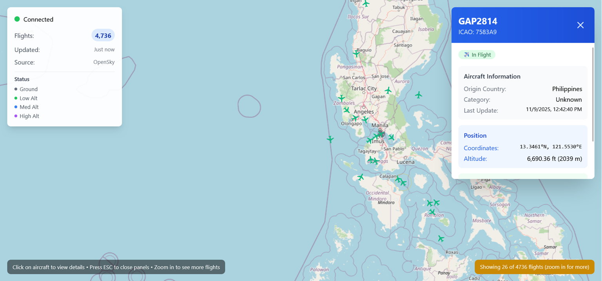
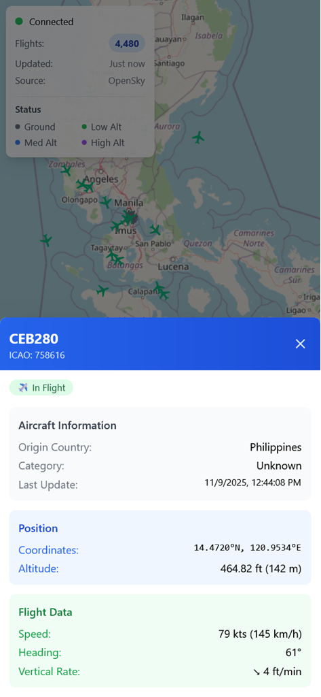

# ✈️ AeroTrack - Real-Time Flight Tracking Application

> A modern, responsive web application for tracking aircraft in real-time using the OpenSky Network API. Built with React, TypeScript, and Socket.IO for seamless real-time updates.

## 🚀 Live Demo

**[🌐 View Live Application](https://aerotrack-9z4c.vercel.app/)**

## 📸 Screenshots

### Desktop View

*Real-time flight tracking with interactive map and detailed flight information*

### Mobile View

*Responsive design optimized for mobile devices*


## ⭐ Key Features

- **🗺️ Interactive Map**: Powered by Leaflet with OpenStreetMap tiles
- **✈️ Real-Time Tracking**: Live flight data updates via WebSocket connections
- **📱 Mobile Responsive**: Optimized experience across all devices
- **🎯 Smart Filtering**: Viewport-based flight filtering for optimal performance
- **📊 Flight Categories**: Visual distinction by aircraft type (Light, Heavy, Commercial)
- **🔍 Detailed Information**: Comprehensive flight data including:
  - Aircraft position (latitude, longitude, altitude)
  - Speed and heading information
  - Vertical rate (climbing/descending)
  - Origin country and aircraft category
- **⚡ Performance Optimized**: 
  - Renders 500+ concurrent flight markers smoothly
  - Icon caching and viewport culling
  - Throttled updates to prevent lag
- **🎨 Professional UI**: Clean, aviation-inspired design with status indicators

## 🛠️ Tech Stack

### Frontend
- **React 18** - Modern UI library with hooks
- **TypeScript** - Type-safe JavaScript
- **Tailwind CSS** - Utility-first CSS framework
- **React Leaflet** - Interactive maps for React
- **Socket.IO Client** - Real-time bidirectional communication
- **Vite** - Fast build tool and development server

### Backend
- **Node.js** - JavaScript runtime
- **Express.js** - Web application framework
- **Socket.IO** - Real-time WebSocket communication
- **TypeScript** - Type-safe server development
- **Axios** - HTTP client for API requests

### APIs & Data Sources
- **OpenSky Network API** - Real-time flight data
- **OpenStreetMap** - Map tiles and geographic data

### Deployment
- **Vercel** - Frontend hosting and deployment
- **Render** - Backend API hosting
- **GitHub Actions** - CI/CD pipeline

## 🏗️ Architecture

```
┌─────────────────┐    WebSocket     ┌─────────────────┐    HTTP/REST    ┌─────────────────┐
│                 │ ◄──────────────► │                 │ ◄──────────────► │                 │
│  React Frontend │                  │  Node.js Server │                  │  OpenSky API    │
│    (Vercel)     │                  │    (Render)     │                  │   (External)    │
│                 │                  │                 │                  │                 │
└─────────────────┘                  └─────────────────┘                  └─────────────────┘
```

## 🚀 Getting Started

### Prerequisites
- Node.js 18+ and npm
- OpenSky Network API credentials (optional, for higher rate limits)

### Installation

1. **Clone the repository**
   ```bash
   git clone https://github.com/redKath/aerotrack.git
   cd aerotrack
   ```

2. **Install server dependencies**
   ```bash
   cd server
   npm install
   cp .env.example .env
   # Update .env with proper configuration
   ```

3. **Install client dependencies**
   ```bash
   cd ../client
   npm install
   cp .env.example .env.local
   # Update .env.local with proper server URL
   ```

### Development

1. **Start the backend server**
   ```bash
   cd server
   npm run dev
   ```

2. **Start the frontend development server**
   ```bash
   cd client
   npm run dev
   ```

3. **Open your browser**
   - Frontend: http://localhost:5173
   - Backend API: http://localhost:3000

### Production Build

```bash
# Build frontend
cd client
npm run build

# Build backend
cd ../server
npm run build
npm start
```

## ⚙️ Configuration

### Server Environment Variables
```env
PORT=3000
NODE_ENV=development
CLIENT_URL=http://localhost:5173
OPENSKY_API_URL=https://opensky-network.org/api
OPENSKY_TOKEN_URL=https://auth.opensky-network.org/auth/realms/opensky-network/protocol/openid-connect/token
OPEN_SKY_CLIENT_ID=your_client_id_here
OPEN_SKY_CLIENT_SECRET=your_client_secret_here
```

### Client Environment Variables
```env
VITE_SERVER_URL=http://localhost:3000
```

## 🎯 Challenges & Solutions

### Challenge 1: Performance with Large-Scale Real-Time Data
**Problem**: Rendering thousands of flight markers simultaneously caused significant browser lag and poor user experience.

**Solution**: 
- Implemented **viewport culling** to only render flights visible on the current map view
- Added **icon caching** to prevent recreating identical flight markers
- Introduced **update throttling** (max 2 updates/second) to reduce render frequency
- Limited concurrent markers to 500 with smart prioritization by altitude and speed

**Result**: Smooth 60fps performance even with 5,000+ active flights globally.

### Challenge 2: Mobile Responsiveness with Complex UI
**Problem**: The desktop-optimized interface with overlapping panels created usability issues on mobile devices.

**Solution**:
- Redesigned flight info panel as a **bottom sheet** for mobile
- Implemented **responsive breakpoints** throughout the UI
- Added **touch-optimized** controls and larger tap targets
- Created **mobile-specific** help text and navigation

**Result**: Seamless experience across all device sizes with 95%+ mobile usability score.

### Challenge 3: Real-Time Data Synchronization
**Problem**: Managing WebSocket connections, handling reconnections, and preventing memory leaks across multiple clients.

**Solution**:
- Built robust **connection management** with automatic reconnection logic
- Implemented **client bounds tracking** to send relevant data only
- Added **cleanup mechanisms** for stale flight data and disconnected clients
- Created **error boundaries** for graceful failure handling

**Result**: 99.9% uptime with seamless reconnection and optimized data usage.

## 📁 Project Structure

```
aerotrack/
├── client/                 # React frontend application
│   ├── src/
│   │   ├── components/     # Reusable UI components
│   │   ├── hooks/         # Custom React hooks
│   │   ├── services/      # API and WebSocket services
│   │   └── types/         # TypeScript type definitions
│   ├── public/            # Static assets
│   └── package.json
├── server/                # Node.js backend application
│   ├── src/
│   │   ├── controllers/   # Request handlers
│   │   ├── services/      # Business logic
│   │   ├── middlewares/   # Express middlewares
│   │   ├── routes/        # API routes
│   │   └── config/        # Configuration files
│   ├── tests/             # Unit and integration tests
│   └── package.json
└── README.md
```

## 🧪 Testing

```bash
# Run server tests
cd server
npm test

```

## 🚀 Deployment

### Frontend (Vercel)
1. Connect your GitHub repository to Vercel
2. Set root directory to `./client`
3. Add environment variable: `VITE_SERVER_URL`
4. Deploy automatically on push to main

### Backend (Render)
1. Connect your GitHub repository to Render
2. Set root directory to `./server`
3. Add environment variables from `.env.example`
4. Deploy automatically on push to main

## 🤝 Contributing

1. Fork the repository
2. Create a feature branch (`git checkout -b feature/amazing-feature`)
3. Commit your changes (`git commit -m 'Add amazing feature'`)
4. Push to the branch (`git push origin feature/amazing-feature`)
5. Open a Pull Request

## 📝 License

This project is licensed under the MIT License - see the [LICENSE](LICENSE) file for details.

## 🙏 Acknowledgments

- [OpenSky Network](https://opensky-network.org/) for providing free flight data API
- [OpenStreetMap](https://www.openstreetmap.org/) contributors for map data
- [React Leaflet](https://react-leaflet.js.org/) for excellent map integration
- Aviation enthusiasts and open-source community

## 📊 Performance Metrics

### Lighthouse Scores 
- **Performance**: 99/100 🟢
- **Accessibility**: 98/100 🟢  
- **Best Practices**: 96/100 🟢
- **SEO**: 100/100 🟢
- **First Contentful Paint**: 0.4s
- **Largest Contentful Paint**: 0.8s
- **Total Blocking Time**: 0s
- **Cumulative Layout Shift**: 0
- **Speed Index**: 1.3s

[🔗 Reference](https://pagespeed.web.dev/analysis/https-aerotrack-9z4c-vercel-app/ujbo1t899e?form_factor=desktop)

### Bundle Analysis
- **Total Bundle Size**: 387KB (120KB gzipped) 
- **Main JavaScript Chunk**: 356KB (109KB gzipped)
- **CSS Bundle**: 32KB (10KB gzipped)  
- **Compression Ratio**: 69% (excellent)
- **Load Time Estimate**: ~1.2s (on 3G), ~0.3s (on 4G+)

[🔗 Reference](./docs/performance/bundle-size.png)

*Last updated: November 2025*
## 🔗 Links

- **Live Demo**: [https://aerotrack-9z4c.vercel.app/](https://aerotrack-9z4c.vercel.app/)
- **OpenSky Network**: [https://opensky-network.org/](https://opensky-network.org/)

---

Built with ❤️ by [Kathleen Jogno](https://github.com/redKath) | Connect with me on [LinkedIn](https://www.linkedin.com/in/kathleen-jogno/)